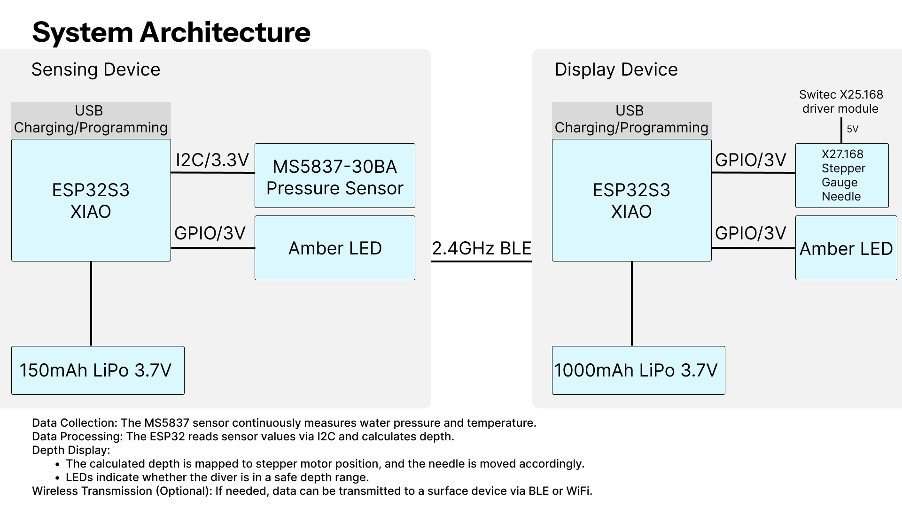
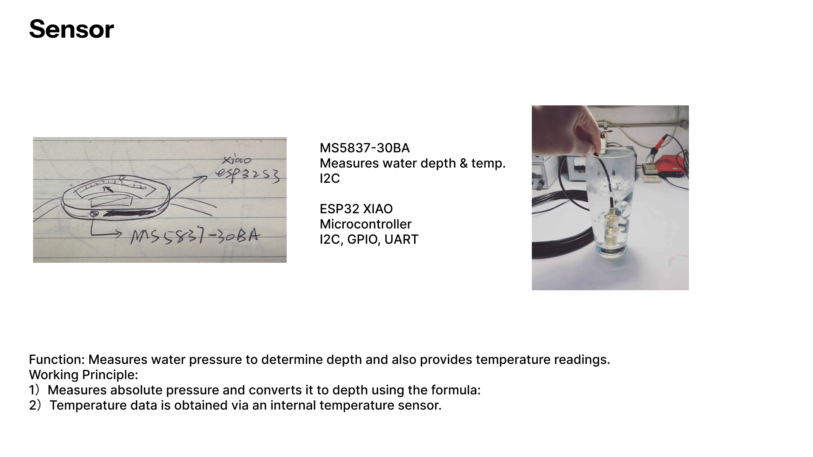
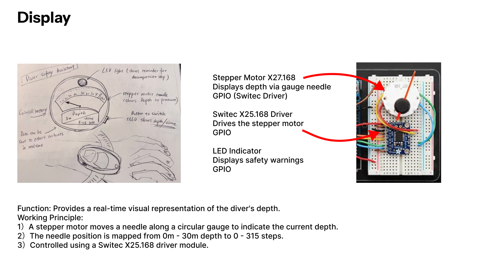

# 📌 514 Final Project

## 1️⃣ Project Overview
This project is designed to **measure pressure and temperature** using an **MS5837-30BA sensor** and display the results using a **stepper-motor-driven gauge needle**. The system is powered by an **ESP32-S3 microcontroller**, which processes the data and transmits it wirelessly if needed.

### **Physical Features:**
- **Sensor Device**: MS5837-30BA pressure and temperature sensor.
- **Processing Unit**: ESP32-S3 for data collection and control.
- **Display Device**: A stepper-motor-driven gauge needle for analog-style visualization.
- **Power Source**: LiPo battery for wireless operation.

**System Architecture Sketch:**  

---

## 2️⃣ Sensor Device: MS5837-30BA
The **MS5837-30BA** is a **pressure and temperature sensor** that communicates with the ESP32-S3 via the **I2C protocol**. It is used to measure environmental **pressure** and **temperature** in real-time.

### **How it Works:**
- The **sensor measures pressure** in millibars (mbar) and **temperature** in degrees Celsius (°C).
- It transmits data to the **ESP32-S3 via I2C**.
- The ESP32 processes the data and prepares it for display.

### **Sensor Diagram:**

### **Sensor Part Number:**
- **Pressure & Temperature Sensor**: MS5837-30BA  

---

## 3️⃣ Display Device: Stepper-Motor-Driven Gauge Needle
The **stepper motor with a gauge needle** provides an **analog-style display** of pressure readings. The needle moves proportionally to the measured pressure.

### **How it Works:**
- The **ESP32-S3** sends control signals to the **motor driver**.
- The **stepper motor rotates** to move the gauge needle.
- The **needle position** corresponds to the measured pressure.
- The **display updates in real-time**.

### **Display Diagram:**

### **Display Components & Part Numbers:**
- **Stepper Motor**: X25-589  
- **Motor Driver**: SP_X27_e_C  

---

## 4️⃣ System Communication & Detailed Diagram
The **ESP32-S3** acts as the central unit, reading sensor data, processing it, and sending commands to the display.

### **Communication Flow:**
1. **MS5837-30BA sensor** measures pressure and temperature.
2. The sensor **sends data via I2C** to the ESP32-S3.
3. The **ESP32 processes the data** and converts it into a stepper motor signal.
4. The **motor driver (SP_X27_e_C) moves the gauge needle** to display pressure.
5. Optional: **Wireless transmission** can be added using **ESP32's 2.4GHz antenna**.

### **System Diagram:**
**Device Communication Chart**:  

---

